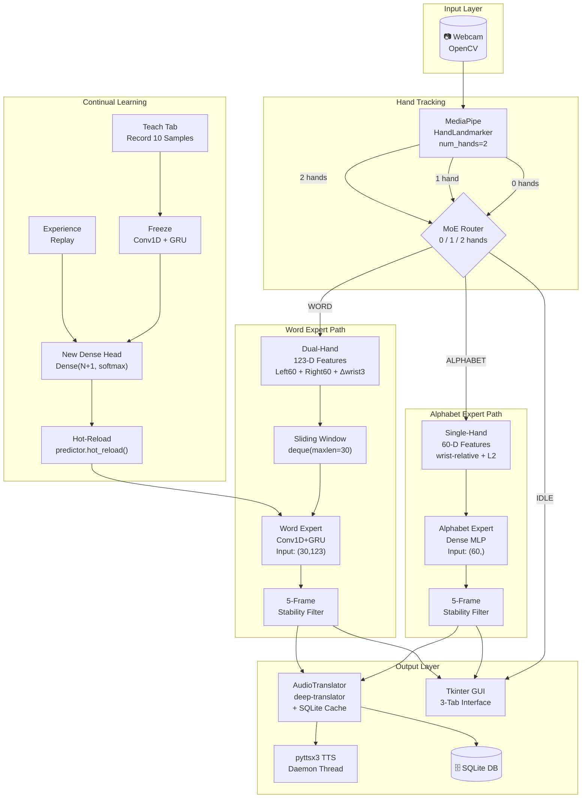
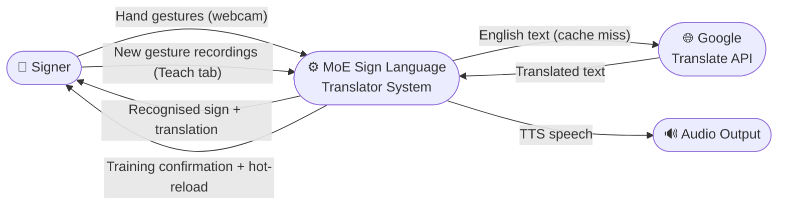
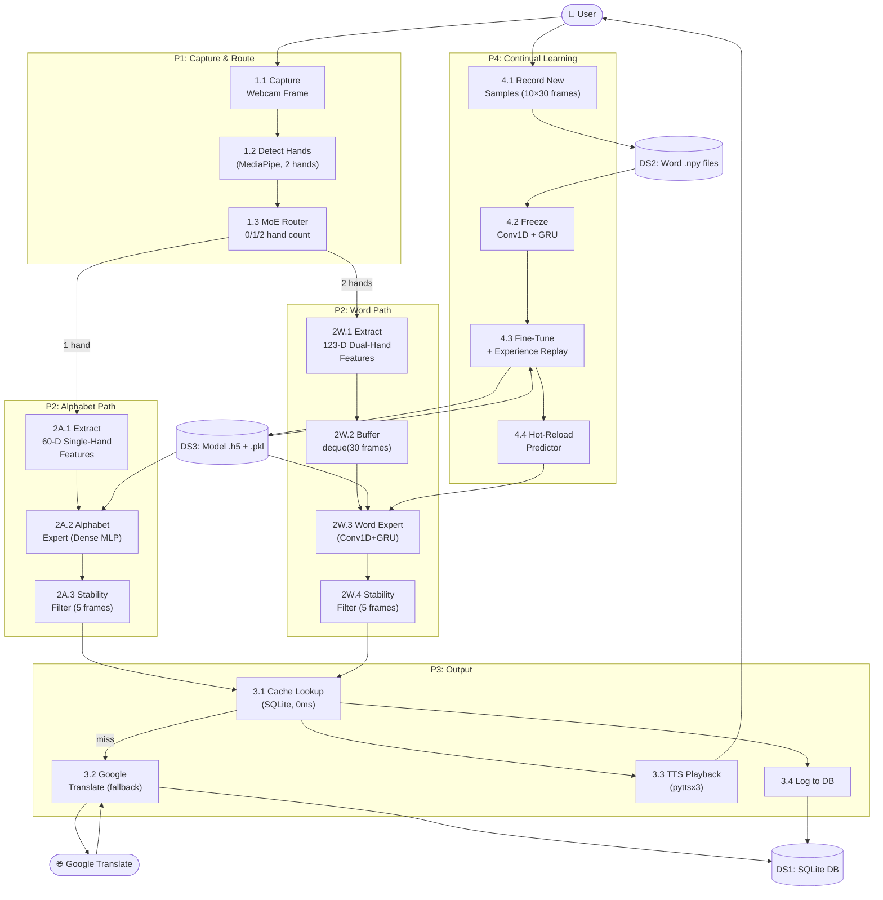
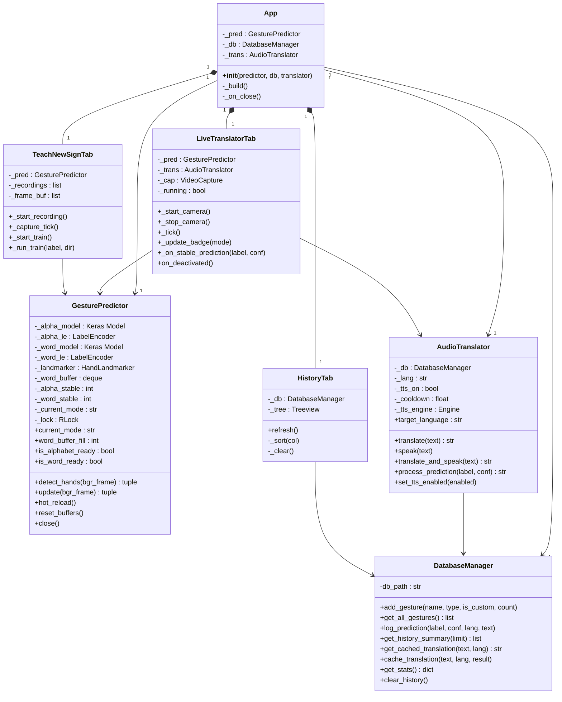
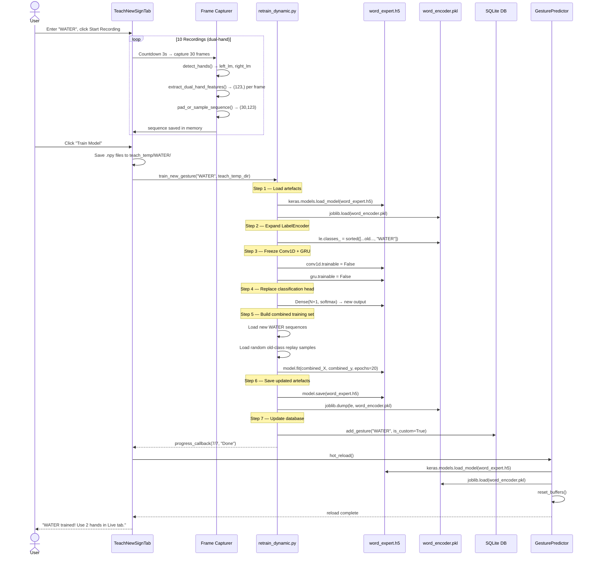

# 🤟 Multilingual Real-Time Sign Language Translator — MoE Edition

> **Final Year Computer Science Engineering Project**
> A Hierarchical **Mixture-of-Experts** (MoE) deep learning system for recognising 26 static alphabets (A–Z) and 100+ dynamic word gestures in real-time, with multilingual translation and audio output.

---

## Abstract

Traditional sign language recognition systems use a single monolithic model for all gesture types, resulting in accuracy and latency trade-offs. This project implements a **Hierarchical Mixture-of-Experts (MoE)** architecture where a router dynamically dispatches incoming hand data to the most appropriate specialist model:

- **Alphabet Expert** — A compact Dense MLP trained on single-hand static images (60-D wrist-relative features).
- **Word Expert** — A Conv1D + GRU spatio-temporal network trained on dual-hand video sequences (123-D features × 30 frames).

The system supports **continual / transfer learning**, allowing users to extend the Word Expert with new custom gestures at runtime without retraining from scratch.

---

## Table of Contents

1. [Functional Architecture](#1-functional-architecture)
2. [Feature Highlights](#2-feature-highlights)
3. [Technology Stack](#3-technology-stack)
4. [Project Structure](#4-project-structure)
5. [Dataset Acquisition](#5-dataset-acquisition)
6. [Setup & Installation](#6-setup--installation)
7. [Execution Guide](#7-execution-guide)
8. [Architecture Diagrams](#8-architecture-diagrams)
9. [Model Architectures](#9-model-architectures)
10. [Database Schema](#10-database-schema)
11. [Continual Learning Pipeline](#11-continual-learning-pipeline)
12. [Troubleshooting](#12-troubleshooting)

---

## 1. Functional Architecture

```
Webcam Frame
    │
    ▼
MediaPipe Hand Detection (num_hands=2)
    │
    ├─ 0 hands ──────────────────────────────► IDLE
    │
    ├─ 1 hand  ──► 60-D single-hand features ─► Alphabet Expert ─► 5-frame stability ─► Letter
    │                (wrist-relative, L2-norm)   (Dense MLP)
    │
    └─ 2 hands ──► 123-D dual-hand features  ─► deque(30 frames) ─► Word Expert ─► 5-frame stability ─► Word
                   (left60 + right60 + Δwrist3)  (Conv1D + GRU)
                         │
                         ▼
               Translation (deep-translator + SQLite cache)
                         │
                         ▼
               Text-to-Speech (pyttsx3, daemon thread)
```

---

## 2. Feature Highlights

| Feature | Detail |
|---|---|
| **MoE Router** | 0/1/2-hand dispatch to correct expert |
| **Alphabet Expert** | Dense MLP — fast static letter recognition |
| **Word Expert** | Conv1D + GRU — temporal word dynamics |
| **123-D dual-hand features** | Left(60) + Right(60) + Inter-wrist(3) |
| **Wrist-relative normalisation** | Scale- and position-invariant |
| **5-frame stability filter** | Per-expert, prevents flickering outputs |
| **Continual learning** | Extend Word Expert at runtime, no full retrain |
| **Experience replay** | Prevents catastrophic forgetting |
| **SQLite translation cache** | 0ms latency on repeat phrases |
| **9-language TTS** | Threaded pyttsx3 with debounce |
| **Router Status Badge** | Live "Alphabet / Word / Idle" mode overlay |
| **Hot-reload** | Model reloaded in-place after fine-tuning |

---

## 3. Technology Stack

| Layer | Library | Version |
|---|---|---|
| Language | Python | 3.11 |
| Computer Vision | OpenCV | ≥ 4.9 |
| Hand Tracking | MediaPipe Tasks | ≥ 0.10.14 |
| Deep Learning | TensorFlow / Keras | ≥ 2.16 |
| ML Utilities | scikit-learn, joblib | ≥ 1.4 |
| Numerical | NumPy, Pandas | ≥ 1.26 |
| Translation | deep-translator | ≥ 1.11 |
| TTS | pyttsx3 | ≥ 2.90 |
| GUI | Tkinter / ttk | (stdlib) |
| Image | Pillow | ≥ 10.3 |
| Database | SQLite3 | (stdlib) |

---

## 4. Project Structure

```
Anti_major_1/
│
├── config.py                      # All constants, paths, hyperparameters
├── main.py                        # Entry point with env validation + auto-download
├── requirements.txt
├── hand_landmarker.task           # MediaPipe asset (auto-downloaded if missing)
│
├── src/
│   ├── __init__.py
│   ├── database_manager.py        # SQLite: gestures, history, translation_cache
│   ├── utils.py                   # Feature engineering + OpenCV helpers
│   ├── process_alphabets.py       # Image → (60,) .npy for Alphabet Expert
│   ├── process_words.py           # Video → (30,123) .npy for Word Expert
│   ├── train_moe.py               # Train Alphabet Expert + Word Expert
│   ├── retrain_dynamic.py         # Continual transfer learning (Word Expert)
│   ├── predict.py                 # MoE predictor + router + stability filters
│   ├── translator.py              # Translation + TTS with SQLite cache
│   └── gui.py                     # Multi-tab Tkinter application
│
├── data/
│   ├── raw/
│   │   ├── alphabets/             # ← Kaggle ASL Alphabet dataset
│   │   │   ├── A/  B/  ... Z/
│   │   └── words/                 # ← Kaggle WLASL video dataset
│   │       ├── hello/  thanks/  ...
│   ├── processed/
│   │   ├── alphabets/             # .npy (60,) per image
│   │   └── words/                 # .npy (30,123) per video
│   ├── teach_temp/                # Temp sequences during Teach session
│   └── sign_language_app.db
│
├── models/
│   ├── alphabet_expert.h5
│   ├── alphabet_encoder.pkl
│   ├── word_expert.h5
│   └── word_encoder.pkl
│
└── logs/
    └── app.log
```

---

## 5. Dataset Acquisition

### 5.1 ASL Alphabet Dataset (Static Images)

Download from Kaggle:
```
https://www.kaggle.com/datasets/grassknoted/asl-alphabet
```

Extract so the structure is:
```
data/raw/alphabets/
    A/  A1.jpg  A2.jpg  ...
    B/  B1.jpg  ...
    ...
    Z/  Z1.jpg  ...
```

### 5.2 WLASL Processed Video Dataset (Dynamic Words)

Download from Kaggle:
```
https://www.kaggle.com/datasets/risangbaskoro/wlasl-processed
```

Extract so the structure is:
```
data/raw/words/
    hello/   0001.mp4  0002.mp4  ...
    thanks/  0001.mp4  ...
    ...
```

> **Note:** You need a Kaggle account and API key. The Kaggle CLI (`pip install kaggle`) can automate the download:
> ```bash
> kaggle datasets download -d grassknoted/asl-alphabet -p data/raw/alphabets --unzip
> kaggle datasets download -d risangbaskoro/wlasl-processed -p data/raw/words --unzip
> ```

---

## 6. Setup & Installation

### 6.1 Prerequisites

- Python 3.11
- Webcam (dual-hand word mode requires both hands to be visible)
- Internet connection (for translation API + auto-download of MediaPipe task file)

### 6.2 Create Virtual Environment

```bash
cd "Anti_major_1"
python -m venv .venv
.venv\Scripts\activate          # Windows
# source .venv/bin/activate     # Linux / macOS
```

### 6.3 Install Dependencies

```bash
pip install -r requirements.txt
```

> **Note:** `hand_landmarker.task` is **auto-downloaded** by `main.py` if not present.
> To download manually:
> ```bash
> Invoke-WebRequest -Uri "https://storage.googleapis.com/mediapipe-models/hand_landmarker/hand_landmarker/float16/1/hand_landmarker.task" -OutFile "hand_landmarker.task"
> ```

---

## 7. Execution Guide

### Step 1 — Process the Alphabet Dataset

```bash
python -m src.process_alphabets
```

Reads `data/raw/alphabets/{A-Z}/*.jpg`, runs MediaPipe static image detection,
saves `(60,)` `.npy` vectors to `data/processed/alphabets/{A-Z}/`.

### Step 2 — Process the Word Video Dataset

```bash
python -m src.process_words
```

Reads `data/raw/words/{word}/*.mp4`, extracts dual-hand 123-D features,
saves `(30, 123)` `.npy` sequences to `data/processed/words/{word}/`.

### Step 3 — Train the MoE Experts

```bash
python -m src.train_moe --expert both
# Or train individually:
python -m src.train_moe --expert alphabet
python -m src.train_moe --expert word
```

Outputs:
- `models/alphabet_expert.h5` + `models/alphabet_encoder.pkl`
- `models/word_expert.h5` + `models/word_encoder.pkl`
- SQLite `gestures` table populated

### Step 4 — Launch the Application

```bash
python main.py
```

### Step 5 — Teach a New Custom Word (optional)

In the **Teach Custom Sign** tab:
1. Enter a gesture label (e.g., `WATER`).
2. Click **Start Recording** → perform the sign with **both hands** 10 times.
3. Click **Train Model** → fine-tuning runs in a background thread.
4. Switch to **Real-Time Translator** to test with 2 hands.

---

## 8. Architecture Diagrams

### 8.1 Overall MoE System Architecture



---

### 8.2 Level 0 DFD (Context Diagram)



---

### 8.3 Level 1 DFD (Process Breakdown)



---

### 8.4 UML Class Diagram



---

### 8.5 Continual Learning Sequence Diagram



---

## 9. Model Architectures

### 9.1 Alphabet Expert (Dense MLP)

```
Input: (60,)  — wrist-relative single-hand features
─────────────────────────────────────────────────
Dense(128, relu)   → (128,)
Dropout(0.3)       → (128,)
Dense(64,  relu)   → (64,)
Dense(26,  softmax)→ (26,)    [A–Z]
─────────────────────────────────────────────────
Params ≈ 16,506
```

### 9.2 Word Expert (Conv1D + GRU)

```
Input: (30, 123)  — dual-hand sequences
─────────────────────────────────────────────────────────────
Conv1D(64, kernel=3, same, relu)  → (30, 64)
MaxPooling1D(pool=2)              → (15, 64)
GRU(64, return_sequences=False)   → (64,)
Dense(128, relu)                  → (128,)
Dropout(0.5)                      → (128,)
Dense(N, softmax)                 → (N,)    [word classes]
─────────────────────────────────────────────────────────────
Params ≈ 37,000 + (128·N + N)
```

### 9.3 Feature Normalisation

| Feature Set | Formula | Output Shape |
|---|---|---|
| Single-hand | `(lm[1:21] - lm[0]) / ‖lm[1:21] - lm[0]‖₂` | `(60,)` |
| Dual-hand left | `(lm_left[1:21] - lm_left[0]) / norm` | `(60,)` |
| Dual-hand right | `(lm_right[1:21] - lm_right[0]) / norm` | `(60,)` |
| Inter-wrist | `lm_left[0] - lm_right[0]` | `(3,)` |
| **Combined** | concat(left, right, inter-wrist) | **`(123,)`** |

---

## 10. Database Schema

```sql
-- Gesture registry with type constraint
CREATE TABLE gestures (
    id           INTEGER   PRIMARY KEY AUTOINCREMENT,
    gesture_name TEXT      NOT NULL UNIQUE,
    gesture_type TEXT      NOT NULL CHECK(gesture_type IN ('Alphabet','Word')),
    is_custom    INTEGER   NOT NULL DEFAULT 0,
    sample_count INTEGER   NOT NULL DEFAULT 0,
    date_added   TIMESTAMP NOT NULL DEFAULT (datetime('now'))
);

-- Full prediction audit log
CREATE TABLE prediction_history (
    id               INTEGER   PRIMARY KEY AUTOINCREMENT,
    predicted_label  TEXT      NOT NULL,
    confidence_score REAL      NOT NULL,
    target_language  TEXT      NOT NULL,
    translated_text  TEXT      NOT NULL,
    timestamp        TIMESTAMP NOT NULL DEFAULT (datetime('now'))
);

-- Translation cache — 0ms on repeat phrases
CREATE TABLE translation_cache (
    id              INTEGER PRIMARY KEY AUTOINCREMENT,
    english_text    TEXT    NOT NULL,
    target_language TEXT    NOT NULL,
    translated_text TEXT    NOT NULL,
    UNIQUE(english_text, target_language)
);
```

---

## 11. Continual Learning Pipeline

The system extends the **Word Expert** with new gestures using layer-freezing transfer learning:

1. **Load** existing `word_expert.h5` + `word_encoder.pkl`
2. **Expand** `LabelEncoder.classes_` with the new label (sorted for determinism)
3. **Freeze** `conv1d_*`, `maxpool_*`, and `gru_*` layers (`trainable = False`)
4. **Replace** the final `Dense(N, softmax)` with `Dense(N+1, softmax)`
5. **Combine** new samples + ≤10 random replay samples per old class
6. **Fine-tune** at `lr=1e-4` for 20 epochs with `EarlyStopping`
7. **Save** updated `.h5` + `.pkl`; copy new sequences to `processed/words/`
8. **Hot-reload** in `GesturePredictor` — zero application downtime

---

## 12. Troubleshooting

| Problem | Cause | Fix |
|---|---|---|
| `hand_landmarker.task` not found | Not downloaded | Auto-downloaded on first run; or see §6.3 |
| No hand landmarks detected | Poor lighting | Use bright, even illumination |
| Alphabet mode not triggering | Using 2 hands | Use only 1 hand for alphabet signs |
| Word mode not triggering | Only 1 hand visible | Both hands must be in frame |
| Low confidence / wrong label | Insufficient training data | Collect more samples; re-train |
| `pyttsx3` error on Windows | Missing SAPI voice | Install Windows Speech voices in Settings |
| `deep_translator` timeout | No internet | App falls back to English text |
| Camera index error | Wrong device | Set `CAMERA_INDEX` in `config.py` |
| TF GPU CUDA errors | Version mismatch | Use `pip install tensorflow-cpu` |
| `OSError: [Errno 22]` during training | File path too long (Windows) | Enable long paths in Windows Registry |

---

*Developed as a Final Year B.E. Computer Science Engineering Project — 2025–2026*
*Architecture: Hierarchical Mixture-of-Experts | Python 3.11 | TensorFlow + MediaPipe*
